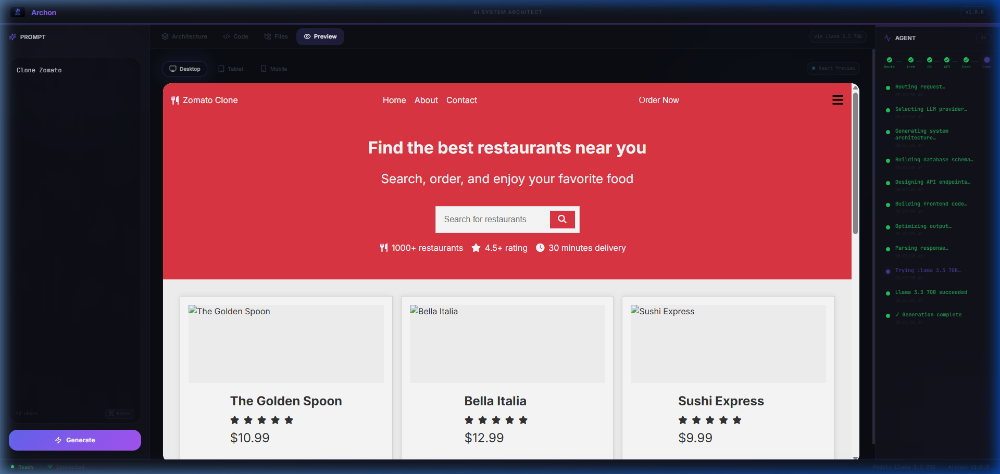

<div align="center">


<br />

[](LICENSE)
[](package.json)
[](https://react.dev)
[](https://groq.com)

**Describe your vision. Archon builds it.**

[Live Demo](https://archon.dinez.in) · [Get Started](#-get-started) · [Report Bug](../../issues)

</div>

---

## ⚡ About

Archon generates **complete system architectures and production-ready React frontends** from a single prompt. Type *"Clone Zomato"* and get a full-stack blueprint with database schemas, API endpoints, and a working React UI — all in under 30 seconds.

<div align="center">
<br />

<br />
<sub>Generated Zomato clone with correct brand colors, restaurant cards, search, and ratings</sub>
<br /><br />
</div>

### What you get

- 🏗️ **Architecture** — System design, DB schemas, API endpoints, tech stack, scaling strategy
- ⚛️ **React Code** — Complete single-file components with brand colors, 8+ data items, search/filter
- 👁️ **Live Preview** — In-browser React rendering via Babel (no build step)
- 📦 **ZIP Download** — Full Vite + React project ready to `npm install && npm run dev`
- 🛡️ **Resilient** — 4-model fallback chain with automatic 413/429 error recovery

<br />

## 🚀 Get Started

```bash
# Clone & install
git clone https://github.com/Ragulvl/Archon.git && cd Archon
npm install && cd backend && npm install && cd ..

# Add your free Groq API key
cp backend/.env.example backend/.env
# Edit backend/.env → GROQ_API_KEYS=gsk_your_key_here

# Run
npm run dev
```

Opens at **localhost:8080** (frontend) + **localhost:5000** (backend).

> 💡 Get a free Groq API key at [console.groq.com/keys](https://console.groq.com/keys)

<br />

## 🧠 How It Works

```
  "Clone Zomato"
       │
       ▼
┌─────────────────────────────┐
│     Production Prompt       │  ~800 tokens, optimized for Groq
│     + Model Fallback        │  Llama 70B → GPT-OSS 120B → GPT-OSS 20B → Llama 8B
└──────────────┬──────────────┘
               ▼
┌─────────────────────────────┐
│      Structured JSON        │  Architecture + React code + CSS
└──────────────┬──────────────┘
               ▼
  ┌──────┬───────┬──────┬─────────┐
  │ Arch │ Code  │Files │ Preview │
  │ View │ View  │ Tree │ (Babel) │
  └──────┴───────┴──────┴─────────┘
```

<br />

## 📁 Structure

```
archon/
├── src/                        # React frontend (TypeScript + Tailwind)
│   ├── components/
│   │   ├── MainPanel.tsx       # Architecture / Code / Files / Preview tabs
│   │   ├── ArchonSidebar.tsx   # Prompt input
│   │   └── AgentPanel.tsx      # Generation progress
│   └── pages/Index.tsx         # Main page + API orchestration
├── backend/
│   ├── services/llm.js         # Groq API · prompt · model fallback
│   ├── routes/generate.js      # POST /generate
│   └── server.js               # Express server
└── docs/                       # Screenshots + banner
```

<br />

## 🌐 Deploy

Includes `render.yaml` for one-click [Render](https://render.com) deployment. Set `GROQ_API_KEYS` in env vars and you're live.

```bash
# Or deploy manually
npm run build && cd backend && node server.js
```

<br />

## 📄 License

MIT — use it however you want.

<div align="center">
<br />

---

<sub>Built with ⚡ speed by <b>Archon</b> — generating the future, one prompt at a time.</sub>

</div>
