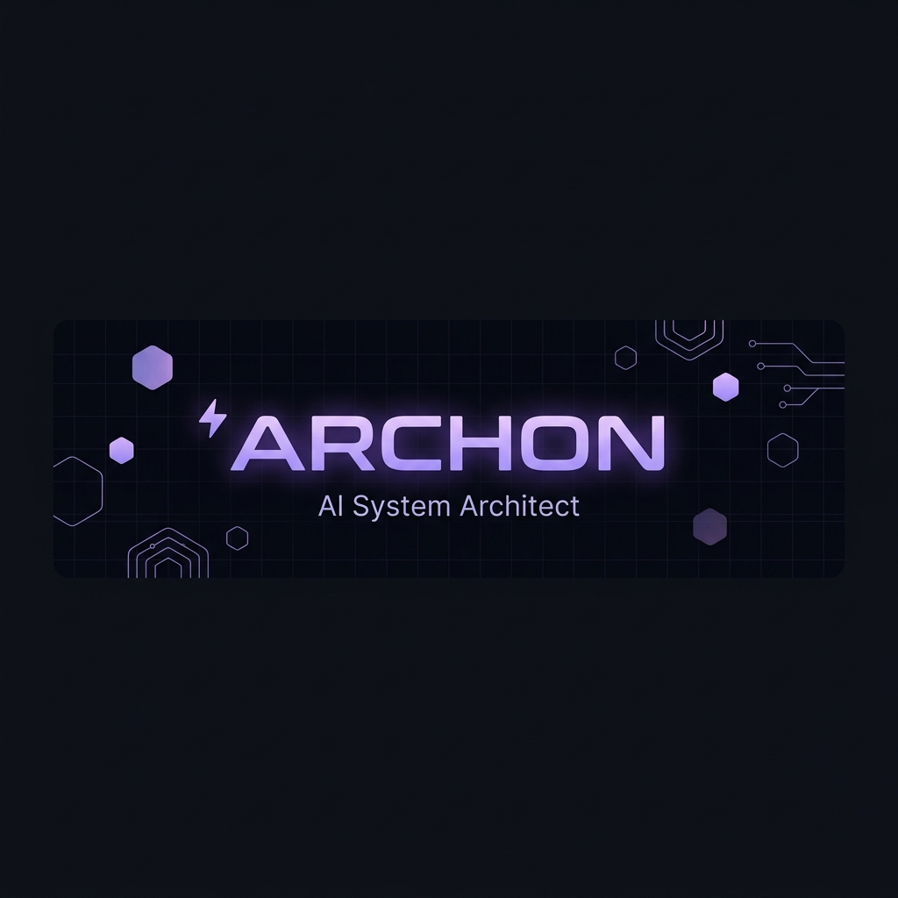
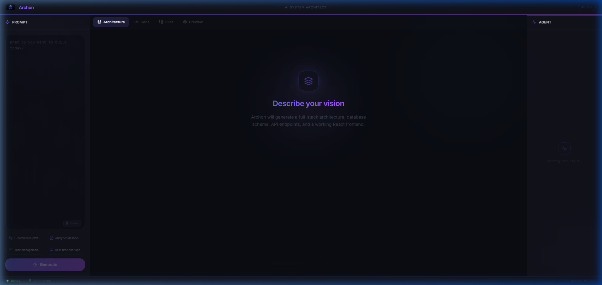
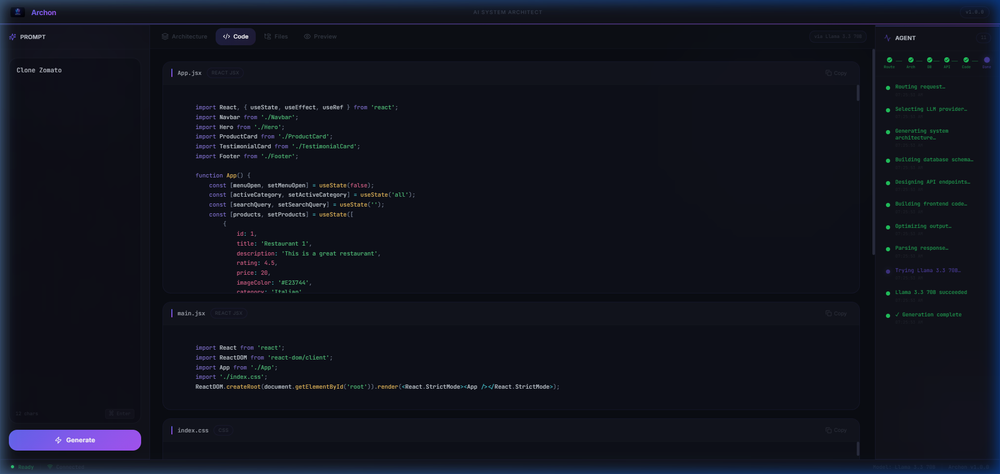

<div align="center">



<br />
<br />

[](LICENSE)
[](package.json)
[](https://react.dev)
[](https://groq.com)
[](https://nodejs.org)

<br />

**Describe your vision. Archon builds it.**

*AI-powered system architect that generates complete technical blueprints<br />and production-ready React frontends from a single prompt.*

[🚀 Live Demo](https://archon.dinez.in) · [📖 Documentation](#-quick-start) · [🐛 Report Bug](../../issues) · [✨ Request Feature](../../issues)

<br />

---

</div>

## ⚡ What is Archon?

Archon is not just another code generator — it's a **complete system architect**. Give it a prompt like *"Clone Zomato"* and it will:

```
📐  Design the full-stack architecture
🗃️  Generate database schemas with proper relationships
🔌  Plan API endpoints with RESTful conventions
⚛️  Build a complete React frontend with real brand colors
🎨  Style everything with CSS variables, animations & responsive design
📦  Package it as a downloadable Vite project
```

All in **under 30 seconds**, powered by Groq's blazing-fast inference.

<br />

<div align="center">
<table>
<tr>
<td align="center"><b>🎯 Input</b></td>
<td align="center"><b>→</b></td>
<td align="center"><b>✨ Output</b></td>
</tr>
<tr>
<td><code>"Clone Zomato"</code></td>
<td align="center">⚡</td>
<td>Full Zomato UI with #E23744 brand red, restaurant cards, search, ratings</td>
</tr>
<tr>
<td><code>"Spotify Clone"</code></td>
<td align="center">⚡</td>
<td>Dark theme (#121212), sidebar, album grids, play buttons with #1DB954 green</td>
</tr>
<tr>
<td><code>"Netflix Clone"</code></td>
<td align="center">⚡</td>
<td>Hero banner, horizontal carousels, hover zoom, #E50914 brand red</td>
</tr>
<tr>
<td><code>"Finance Dashboard"</code></td>
<td align="center">⚡</td>
<td>Professional #1A365D blue theme, charts, analytics cards, data tables</td>
</tr>
</table>
</div>

<br />

## 🖼️ Screenshots

<div align="center">

<details>
<summary><b>🖥️ Main Interface — Dark-themed desktop IDE layout</b></summary>
<br />

<br /><br />
<em>Three-panel layout: Prompt sidebar • Main content area • Agent progress panel</em>
</details>

<details open>
<summary><b>👁️ Live Preview — Real-time React rendering</b></summary>
<br />

<br /><br />
<em>Generated Zomato clone rendering live in the browser with correct brand colors</em>
</details>

<details>
<summary><b>💻 Code View — Syntax-highlighted generated code</b></summary>
<br />

<br /><br />
<em>Full React JSX and CSS code with Prism.js syntax highlighting</em>
</details>

</div>

<br />

## ✨ Features

<table>
<tr>
<td width="50%">

### 🏗️ Architecture Generation
- System design with frontend/backend/database planning
- Database schemas with proper column types and relationships
- RESTful API endpoint design
- Tech stack recommendations
- Scaling strategy planning

</td>
<td width="50%">

### ⚛️ React Code Generation
- Complete React + Vite project output
- Single-file architecture (all components inline)
- Brand-accurate color matching for 10+ popular brands
- 8+ data items with realistic names and content
- 15+ Font Awesome icons per project

</td>
</tr>
<tr>
<td width="50%">

### 👁️ Live Preview
- In-browser React rendering via Babel transpilation
- Desktop / Tablet / Mobile viewport switcher
- Instant preview — no build step required
- React 18 UMD + Babel Standalone under the hood

</td>
<td width="50%">

### 📦 Export & Download
- One-click ZIP download with full Vite scaffolding
- Includes `package.json`, `vite.config.js`, source files
- Architecture docs exported as Markdown + SQL
- Copy-to-clipboard for individual code blocks

</td>
</tr>
<tr>
<td width="50%">

### 🤖 Agent Panel
- Real-time step-by-step generation progress
- Model selection visibility (which AI model was used)
- Error/retry status with automatic fallback logging
- Simulated phase messages for better UX during API calls

</td>
<td width="50%">

### 🛡️ Multi-Model Resilience
- 4-model automatic fallback chain
- 413 (payload too large) → auto-skip to next model
- 429 (rate limit) → rotate API keys and retry
- Graceful demo fallback when all models exhausted

</td>
</tr>
</table>

<br />

## 🏛️ Tech Stack

<div align="center">

| Layer | Technologies | 
|:------|:-------------|
| **Frontend** |     |
| **Backend** |   |
| **AI Models** |     |
| **Build** |   |
| **Preview** |   |

</div>

<br />

## 🚀 Quick Start

### Prerequisites

- **Node.js 18+** — [Download](https://nodejs.org)
- **Groq API Key** (free) — [Get one here](https://console.groq.com/keys)

### Installation

```bash
# 1. Clone the repository
git clone https://github.com/your-username/archon.git
cd archon

# 2. Install dependencies
npm install
cd backend && npm install && cd ..

# 3. Configure your API key
cp backend/.env.example backend/.env
```

Edit `backend/.env` and add your Groq key:

```env
GROQ_API_KEYS=gsk_your_key_here
```

### Development

```bash
npm run dev
```

This launches both servers concurrently:

| Service | URL | Description |
|---------|-----|-------------|
| Frontend | `http://localhost:8080` | Vite dev server with HMR |
| Backend | `http://localhost:5000` | Express API server |

### Production Build

```bash
npm run build          # Build frontend → dist/
cd backend && node server.js   # Serve everything
```

<br />

## 📁 Project Structure

```
archon/
├── 🎨 src/                       # React frontend
│   ├── components/
│   │   ├── TitleBar.tsx          # App header with branding
│   │   ├── ArchonSidebar.tsx     # Prompt input + generate button
│   │   ├── MainPanel.tsx         # Architecture / Code / Files / Preview tabs
│   │   ├── AgentPanel.tsx        # Real-time generation progress
│   │   └── StatusBar.tsx         # Connection & model status
│   ├── pages/
│   │   ├── Index.tsx             # Main page with generation orchestration
│   │   └── NotFound.tsx          # 404 page
│   ├── App.tsx                   # Router setup
│   ├── index.css                 # Design system & global styles
│   └── main.tsx                  # Entry point
│
├── ⚙️ backend/                    # Express API server
│   ├── server.js                 # Server entry + static file serving
│   ├── routes/generate.js        # POST /generate endpoint
│   ├── services/llm.js           # Groq API · prompt engineering · model fallback
│   ├── .env                      # API keys (gitignored)
│   └── .env.example              # Template for env vars
│
├── 📂 public/                     # Static assets
│   ├── Logo.png                  # App logo
│   └── favicon.svg               # Browser icon
│
├── 📸 docs/                       # Documentation & screenshots
│   ├── banner.png                # README banner
│   └── screenshots/              # UI screenshots
│
├── render.yaml                   # Render.com deployment config
├── tailwind.config.ts            # Custom theme (dark mode, glass effects)
├── vite.config.ts                # Vite build + proxy config
└── package.json                  # v1.0.0
```

<br />

## 🔧 Environment Variables

| Variable | Required | Description |
|:---------|:--------:|:------------|
| `GROQ_API_KEYS` | ✅ | Comma-separated Groq API keys for rotation |
| `PORT` | ❌ | Backend port (default: `5000`) |

> **💡 Tip:** Use multiple API keys separated by commas for automatic key rotation on rate limits:
> ```env
> GROQ_API_KEYS=gsk_key1,gsk_key2,gsk_key3
> ```

<br />

## 🧠 How It Works

```
┌─────────────────────────────────────────────────────────────┐
│                      USER PROMPT                            │
│                   "Clone Zomato"                            │
└──────────────────────┬──────────────────────────────────────┘
                       │
                       ▼
┌──────────────────────────────────────────────────────────────┐
│                    ARCHON BACKEND                            │
│                                                              │
│  ┌─────────────┐   ┌──────────────┐   ┌──────────────────┐  │
│  │   System    │ → │  Groq API    │ → │  JSON Parser     │  │
│  │   Prompt    │   │  (4 models)  │   │  + Validator     │  │
│  │   (~800     │   │              │   │                  │  │
│  │   tokens)   │   │  Llama 70B   │   │  Architecture    │  │
│  │             │   │  GPT-OSS 120B│   │  + React Code    │  │
│  │  + User     │   │  GPT-OSS 20B │   │  + CSS           │  │
│  │    Message   │   │  Llama 8B   │   │  + HTML          │  │
│  └─────────────┘   └──────────────┘   └──────────────────┘  │
└──────────────────────┬───────────────────────────────────────┘
                       │
                       ▼
┌──────────────────────────────────────────────────────────────┐
│                    ARCHON FRONTEND                            │
│                                                              │
│  ┌────────────┐ ┌──────────┐ ┌────────┐ ┌────────────────┐  │
│  │Architecture│ │  Code    │ │ Files  │ │    Preview     │  │
│  │   View     │ │  View    │ │ View   │ │  (Babel +      │  │
│  │            │ │ (Prism)  │ │ (Tree) │ │   React UMD)   │  │
│  └────────────┘ └──────────┘ └────────┘ └────────────────┘  │
└──────────────────────────────────────────────────────────────┘
```

<br />

## 🌐 Deployment

### Render.com (Recommended)

The project includes `render.yaml` for one-click deployment:

1. Push to GitHub
2. Connect repo on [Render.com](https://render.com)
3. Set `GROQ_API_KEYS` in environment variables
4. Deploy → Your app is live!

### Manual Deployment

```bash
npm run build
cd backend
GROQ_API_KEYS=gsk_... PORT=3000 node server.js
```

The backend serves the built frontend from `dist/` automatically.

<br />

## 🎨 Brand Color Database

Archon knows the exact brand colors for popular apps:

| Brand | Primary Color | Hex Code |
|:------|:-------------|:---------|
| 🔴 Zomato |  | `#E23744` |
| 🟢 Spotify |  | `#1DB954` |
| 🔴 Netflix |  | `#E50914` |
| 🩷 Airbnb |  | `#FF5A5F` |
| 🟠 Amazon |  | `#FF9900` |
| 🔴 YouTube |  | `#FF0000` |
| 🟠 Swiggy |  | `#FC8019` |
| 🟢 WhatsApp |  | `#25D366` |
| 🔵 Twitter |  | `#1DA1F2` |
| ⚫ Uber |  | `#000000` |

<br />

## 📄 License

Distributed under the **MIT License**. See `LICENSE` for more information.

<br />

---

<div align="center">

**Built with ⚡ by Archon**

*Generating the future of web development, one prompt at a time.*

<br />

[](https://groq.com)

</div>
